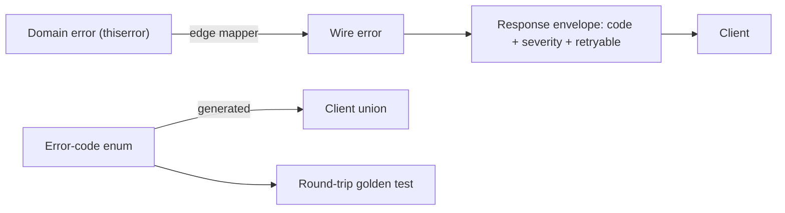

# Rust Error & Audit Model

## Error Codes & Wire Contract

Scope: codes crossing the wire. Internal error *types* stay per-module scope
(see `rule://rust-domain-modeling`) -- one registry of external codes is not
one enum of internal errors.

| Rule | Detail |
|------|--------|
| **Central Registry** | One error-*code* enum for the wire, per-variant `#[serde(rename = "dotted.code")]`; never `rename_all` |
| **Export** | Generate client bindings from registry; lock with round-trip golden test |
| **No Orphan** | Domain crates use `thiserror`; edge boundary only converts via small free-function mappers |
| **Wire Envelope** | code + severity (error/warn/info) + retryable (bool) + recovery actions + field errors |
| **String Fallback** | Legacy/unexpected errors get plain-string message in envelope |
| **Typed Over Sniffing** | Prefer variant match over parsing upstream error messages |
| **Sub-Codes** | Per-operation contracts may own dedicated sub-code enums; document central-vs-sub split to avoid duplication |

## Audit Trail

| Requirement | Detail |
|-------------|--------|
| **Append-Only** | Audit rows never mutate or delete; one row per action |
| **Columns** | actor, outcome (success/fail/partial), trigger (user/system/timeout), request_id, timestamp, severity_tier |
| **Versioned Topic** | Envelope includes schema version; supports log rotation/archival |
| **No Sensitive Data** | Redact credentials, large payloads; include error code + context hints only |

## Error Flow

